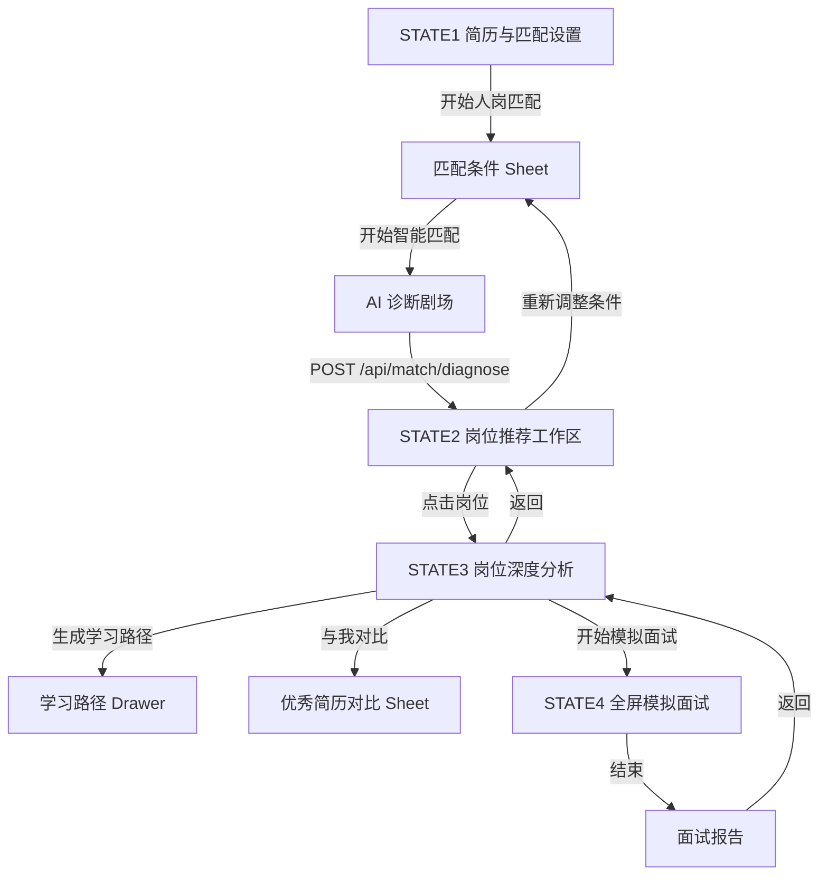

## 产品概述

将现有"人岗匹配"模块重构为单一 Web 模块内的完整闭环：**简历 → 匹配条件 → 简历解析 → 岗位推荐 → 岗位深度分析 → 能力差距图谱 → 学习路径 → 沉浸式模拟面试 → 面试报告**。不拆成多个一级页面，通过主工作区、二级视图、抽屉、Sheet 与全屏状态切换完成。页面定位从"信息展示型网页"升级为"决策型工作台"，每级只解决一个问题（AI 看懂简历了吗 / 我适合什么 / 差在哪里 / 差多远 / 怎么补 / 能过面试吗 / 暴露了什么问题）。

## 核心功能

- **简历入口**：有简历直接展示简历卡（文件名 / 已解析·大小·最近上传 / 查看简历 / 更换简历）+ 大按钮[开始人岗匹配]；无简历则上传（PDF/DOC/DOCX，拖拽 + 点击）。
- **匹配条件设置**：点击开始后不立即调接口，先弹出中央 Sheet：地区多选、期望年薪区间、工作性质、必备技能、偏好技能、其他偏好（应届生/接受异地/接受远程），保持精简。
- **AI 诊断剧场**：7 步日志（解析简历结构→识别教育·项目·技能→建立能力画像→理解岗位需求→语义匹配→能力图谱推理→生成岗位推荐），视觉中心由纯粒子改为"简历→能力节点→岗位节点→建立连接"的图谱建立动画，分析过程提前暴露图谱。
- **岗位推荐工作区**：顶部当前筛选条件 chips + [重新调整条件]；[当前适合]/[未来可发展] 原位切换（未来可发展展示补齐技能清单与预测匹配分）；"最适合"大卡片（匹配分、✓ 匹配项、! 不足项、[查看岗位分析]）+ 其他推荐列表。
- **岗位深度分析**（二级视图，← 返回推荐）：[岗位要求][匹配分析][能力差距] 三 tab；匹配分析用"岗位能力要求 vs 你的能力"水平条视觉对比 + 匹配/部分匹配/能力缺口三段强度。
- **能力差距交互图谱**：左"你的能力"节点、右"岗位要求"节点，绿（强匹配）/黄（部分匹配）/红（缺口）连线；点击节点弹出浮窗（岗位要求 / 当前能力 / 证据来源 / 前置能力 / 建议路径）。
- **学习路径 Drawer**：岗位分析页右下角[生成学习路径]→右侧宽抽屉，[7天][30天][3个月] 切换，节点含学习内容 + 项目实践 + 能力验证 + 预计匹配提升，底部"当前匹配→预计完成后"。
- **优秀简历参考**：页面底部推荐优秀简历（[预览][与我对比]）；对比 Sheet 逐项高亮差距，底部按钮为"查看需要补强的能力"（跳能力差距图谱），不做简历修改。
- **沉浸式模拟面试**：全屏面试空间，AI 面试官 + 求职者双画面、语音驱动问答（AI 提问→用户回答→转文字→理解→决定下一题）、基于 JD/简历/差距/前序回答的动态追问、题号进度。
- **面试报告**：顶部关联本次面试（岗位 / 依据 / 结果），综合分 + 五维评分（技术基础/项目理解/表达能力/逻辑分析/岗位匹配）+ 🔴🟠🟢 分级问题清单。
- **置信度与证据展示**：展示简历解析置信度、技能证据来源（profile.skills.evidence）、匹配依据（五维 dimension 分 + gap_paths 语义证据），把图谱推理变成用户可见依据。
- **彻底删除**：resumeArchives、resumeVersions、V1/V2/V3、版本时间线、版本切换、历史版本匹配、简历直接修改、AI 一键改简历、before/after 编辑器、修改清单、简历生成新版本、旧入口卡片与流水线、"我的档案" tab。

## 技术栈

- **前端**：原生 HTML5 + CSS3 + ES6（沿用现有 vanilla 多页架构，不引入框架），保持 `window.matchState` 全局状态模式
- **动画**：GSAP 3.12.5（CDN 已有）+ Canvas 2D（图谱建立动画，沿用现有粒子模式）
- **可视化**：ECharts 5.5.0（CDN 已有，匹配分析雷达/维度图）
- **语音与媒体**：Web Speech API（SpeechRecognition 语音识别 + SpeechSynthesis 语音合成）、getUserMedia（摄像头/麦克风本地预览），不可用时自动降级文本输入
- **后端接口（本次不改）**：`GET /api/match/jobs`（5 个岗位）、`POST /api/match/diagnose`（FormData: file/mode/target_job_id，130s 超时）；地区/薪资/工作性质过滤由前端完成

## 架构设计

### 状态机（4 核心状态 + 过渡层）

```
STATE1 简历与匹配设置  →  匹配条件 Sheet（弹层）
STATE2 岗位推荐工作区  →  [当前适合]/[未来可发展]
STATE3 岗位深度分析    →  [岗位要求]/[匹配分析]/[能力差距] + 学习路径 Drawer + 优秀简历对比 Sheet + 差距节点浮窗
STATE4 沉浸式模拟面试  →  面试报告层
```



### 数据流

上传简历（校验 PDF/DOC/DOCX/TXT ≤8MB）→ 匹配条件存入 `matchState.preferences` → 剧场动画期间并行调用 diagnose → `matchState.result` 落库 → 推荐页按 preferences 前端过滤排序 → 详情页从 `result.matches[selectedJobId]` 读取 gap_graph/gaps/gap_paths/learning_path → 面试引擎基于 job + profile + gaps 生成题集 → 报告由答题记录 + 缺口注入评分。

### 模块划分

- **状态与路由层**：`matchState.stage` 切换 + 视图容器显隐（主工作区/二级视图/抽屉/全屏）
- **渲染层**：简历入口、匹配 Sheet、剧场、推荐工作区、岗位详情、学习路径、优秀简历对比、面试空间、报告九个渲染函数族
- **数据适配层**：前端薪资/地区/工作性质过滤器（salary 字符串"30-60K"解析为月薪区间与期望年薪换算比较；city 命中；岗位无 job_type 字段时全量保留并在 UI 标注）、"未来可发展"预测分本地公式（预测分 = score + Σ gap 补齐提升，基于 readiness）
- **面试引擎层**：`window.InterviewEngine`（start/askNext/answer/report）mock 实现，接口注释预留后端 LLM 替换

## 关键代码结构

```js
// 状态机（删除全部 archive/version 字段）
window.matchState = {
  stage: 'entry',        // entry | setup | theater | recommend | jobDetail | interview | report
  file: null, result: null, selectedJobId: null,
  preferences: { cities: [], salaryMin: null, salaryMax: null, jobType: '',
                 mustSkills: [], preferSkills: [], others: [] },
  recommendTab: 'now',   // now | future
  jobTab: 'requirement', // requirement | match | gap
  interview: { index: 0, answers: [] }
};
```

```js
// 面试引擎接口（mock 实现，预留后端 LLM 替换）
window.InterviewEngine = {
  start(ctx),   // ctx = { job, profile, gaps }
  askNext(),    // 返回 { text, isFollowUp, questionId }
  answer(text), // 启发式（长度+关键词命中）判定好/弱 → 返回 { nextQuestion, verdict }
  report()      // 返回 { total, dimensions: {...}, issues: [{level, text}] }
};
```

## 实现注意事项

- **删除范围**：match.html 移除 hub-tabs、profile iframe、career- *档案流、旧 match-* 入口 DOM、三个旧 Overlay；match.js 移除 resumeArchives 及全部版本渲染函数、旧模式卡片函数、修改清单/竞争力弹窗；CSS 不动 legacy-views.css（混合其他模块，避免误删），由新建 match.css 在之后引入全量接管新视觉，旧选择器随 DOM 删除自然失效。
- **联动清理**：`shell.js` 中 `PAGE_HREF.profile` 由 `match.html?tab=profile` 改为 `match.html`；`hub-tabs.js` 仅 match 引用，实现时用 code-explorer 复核后从 match.html 移除引用（文件保守保留）；`cinema-bg.js`/`cinema-music.js` 保留。
- **剧场与接口并行**：图谱动画用 Canvas + requestAnimationFrame（沿用现有粒子实现，节点数 ≤20，连线用距离剪枝避免 O(n²)），GSAP 仅做视图过渡与数字滚动；日志 7 步与 diagnose 真实进度解耦，接口失败时进度停在 92% 并给出可重试错误提示。
- **性能**：GSAP 动画只用 transform/opacity；面试 SpeechRecognition 每次会话结束及时 abort 并释放；结果页数据量小（5 岗位）直接 innerHTML 渲染；遵守 prefers-reduced-motion 降级。
- **安全与容错**：文件类型/大小前端校验 + 后端校验双保险；getUserMedia 权限拒绝、语音 API 不可用时静默降级文本框并 toast 提示；面试结束确认后再退出，防止误关丢失报告。
- **接口预留**：`/api/match/diagnose` 调用签名保持不变；面试引擎与"未来可发展"预测公式独立成模块，注释标明可替换为后端 LLM/知识图谱接口。

## 目录结构

```
frontend/
├── pages/
│   └── match.html              # [REWRITE] 单页四状态骨架：简历入口、剧场、推荐工作区、岗位详情、全屏面试、报告及全部抽屉/Sheet；删除档案版本/旧入口/hub-tabs/profile iframe
├── css/
│   ├── match.css               # [NEW] 人岗匹配模块全部新样式（简历卡、Sheet、剧场图谱、对比条、交互图谱、学习路径抽屉、面试空间、报告），在 legacy-views.css 之后引入
│   ├── tokens.css              # [保留] 设计 token 基础（品牌色/字体/圆角/阴影）
│   └── legacy-views.css        # [不动] 旧样式保留（避免影响其他模块），旧选择器随 DOM 删除失效
├── js/
│   ├── pages/match.js          # [REWRITE] 状态机 + 四状态渲染族 + 前端过滤 + 面试引擎（mock）+ 图谱交互
│   ├── pages/hub-tabs.js       # [移除引用] match.html 不再加载；文件保守保留
│   └── shell.js                # [MODIFY] PAGE_HREF.profile 改为 'match.html'
└── index.html                  # [不改] 入口不变
```

## 设计风格

延续 tokens.css 深色电影风（青绿信号色 #1FC8D9 + 深空近黑背景 #06070A），升级为"决策型工作台"：每级视图只解决一个问题，层级分明（主工作区 → 二级视图 → 抽屉/Sheet → 全屏沉浸）。玻璃拟态卡片、发光主按钮、语义化状态色（匹配绿 / 预警黄 / 缺口红）、GSAP 微动效（数字滚动、视图过渡、图谱连线建立），信息密度克制，大字号标题 + 清晰视觉锚点，避免通用 AI 审美。

## 页面规划（按用户 4 状态模型）

**STATE1 简历与匹配设置**

- 顶部区：模块标题"人岗匹配诊断" + 价值主张一句 + 右上[更换简历]入口
- 简历区：有简历显示简历卡（文件图标、文件名、已解析/大小/最近上传、[查看简历][更换简历]）；无简历显示上传区（拖拽 + PDF/DOC/DOCX 提示）
- 主操作：居中大号发光主按钮[开始人岗匹配]
- 匹配设置 Sheet：中央玻璃拟态弹层，六组条件（地区多选 chips / 年薪双区间 / 工作性质单选 / 必备技能标签 / 偏好技能标签 / 其他偏好 chips）+ 底部[开始智能匹配→]

**STATE2 岗位推荐工作区**

- 顶部条件条：当前筛选条件 chips（北京·15-25万·全职 / Java / Spring Boot）+ 右侧[重新调整条件]
- 切换区：[当前适合] [未来可发展] 分段切换器
- 最适合区：大卡片（岗位名、88% 匹配大数字、✓ 匹配项、! 不足项、[查看岗位分析→]）
- 其他推荐区：紧凑列表行（岗位名 + 分数条），点击进详情

**STATE3 岗位深度分析**

- 返回条：← 返回岗位推荐 + 岗位名 + 匹配分
- Tab 区：[岗位要求] [匹配分析] [能力差距]
- 匹配分析：左右对比布局——"岗位能力要求 vs 你的能力"水平百分比条 + 右侧三段强度（匹配 / 部分匹配 / 能力缺口）
- 能力差距：SVG 交互图谱（左"你的能力"节点 → 右"岗位要求"节点，绿/黄/红连线），点击节点右侧弹出证据浮窗
- 学习路径 Drawer：右侧宽抽屉，[7天][30天][3个月] 切换，节点含学习内容/项目实践/能力验证/预计提升，底部当前→预计匹配
- 底部：推荐优秀简历（[预览] + [与我对比] Sheet 高亮差距 + [查看需要补强的能力]）

**STATE4 沉浸式模拟面试**

- 顶部条：岗位名 + 题号进度 01/08 + 退出
- 双画面区：AI 面试官（动态 avatar + 说话波形）与求职者（getUserMedia 实时画面）
- 提问区：AI 提问气泡 + 语音转文字实时字幕 + 正在录音状态
- 控制条：🎤麦克风 / 📹摄像头 / 🔊扬声器开关 + 下一题/结束
- 报告层：本次面试（岗位/依据/结果）+ 综合分 + 五维条 + 🔴🟠🟢 分级问题清单

## Agent Extensions

### Skill

- **Impeccable（前端设计工具集）**
- Purpose: 制定"决策型工作台"视觉规范并产出高品质组件样式（简历卡、匹配 Sheet、岗位对比条、差距交互图谱、学习路径抽屉、全屏面试空间、报告层），避免通用 AI 审美
- Expected outcome: match.css 设计系统落地，视觉完成度高、组件一致性强、深色电影风贯穿四状态
- **gsap-core**
- Purpose: 实现诊断剧场图谱建立动画、匹配分数数字滚动、视图状态切换过渡
- Expected outcome: 关键交互具备平滑 60fps 微动效，符合现有项目 GSAP 用法
- **gsap-timeline**
- Purpose: 编排诊断剧场 7 步日志与"简历→能力节点→岗位节点→连线"图谱建立的时间线序列
- Expected outcome: 剧场动画有清晰先后节奏，与 diagnose 接口进度解耦且可中断
- **gsap-performance**
- Purpose: 优化动画性能（transform/opacity、will-change、避免布局抖动、prefers-reduced-motion 降级）
- Expected outcome: 图谱/粒子动画不掉帧，低配设备与系统"减少动态"模式下优雅降级

### SubAgent

- **code-explorer**
- Purpose: 实现阶段复核 hub-tabs.js 引用范围、legacy-views.css 中 match 旧样式区间、runtime-core.js 的 Utils API、真实运行环境 diagnose 返回字段差异
- Expected outcome: 删除/复用决策有代码级依据，避免误删影响其他页面